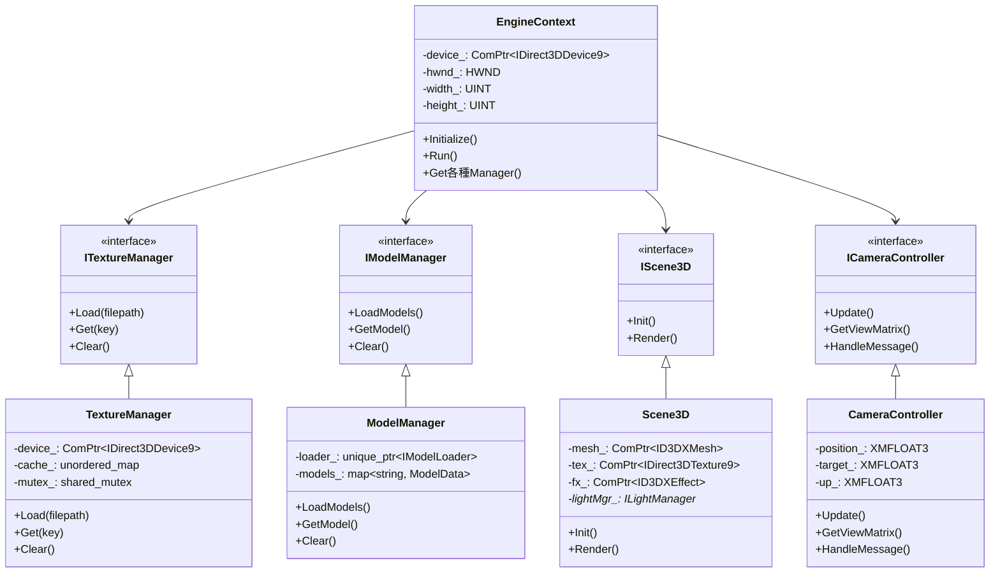
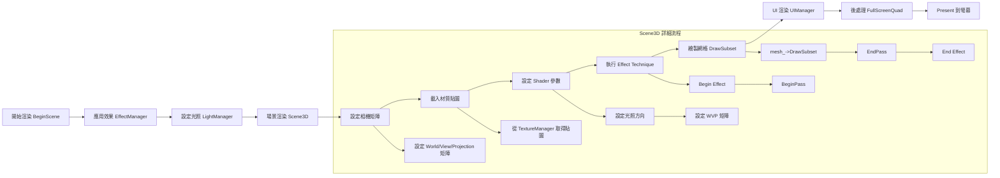
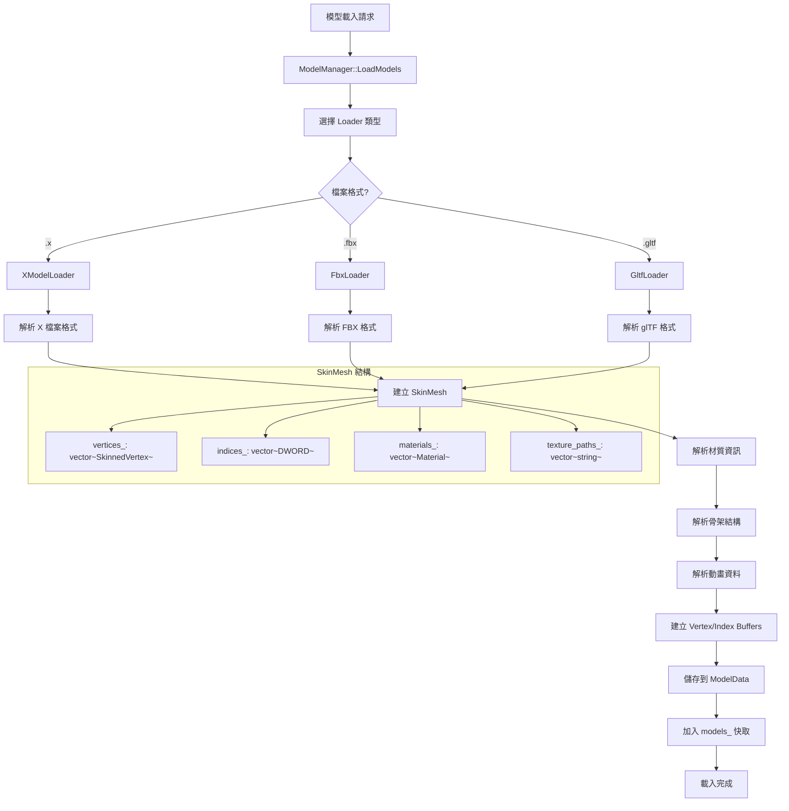
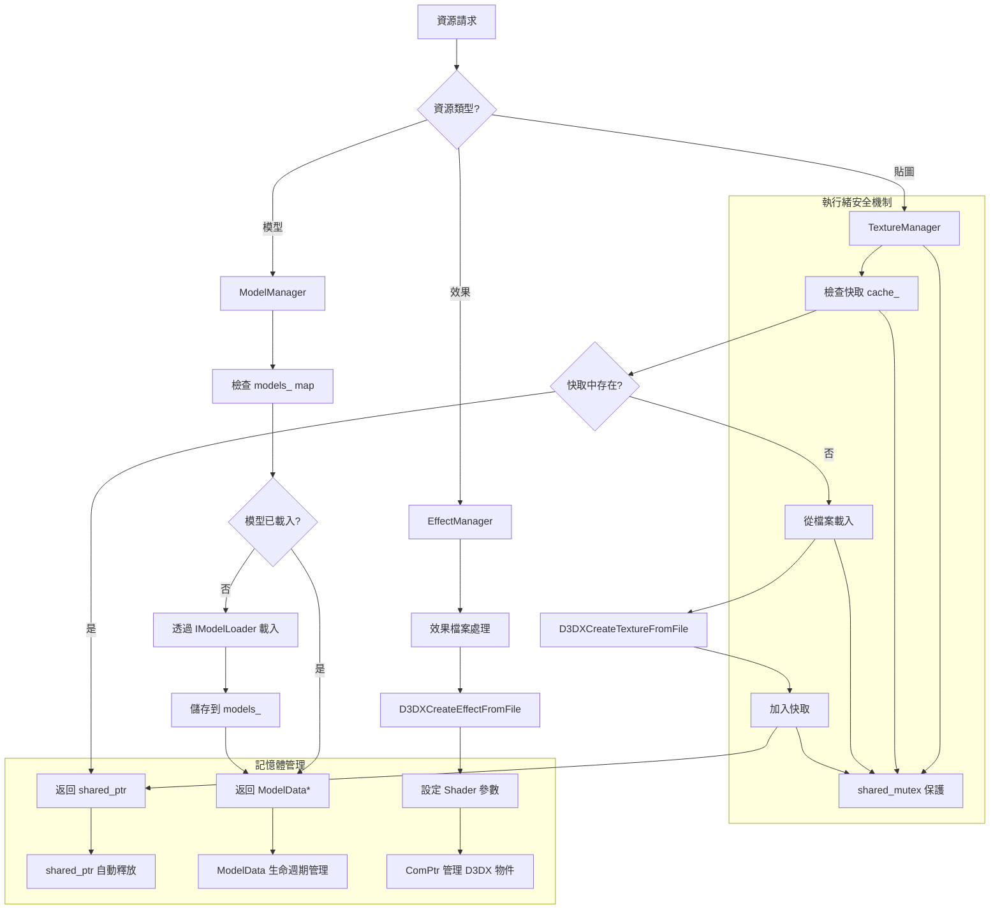
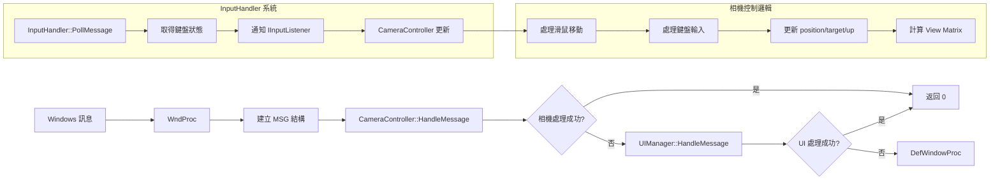
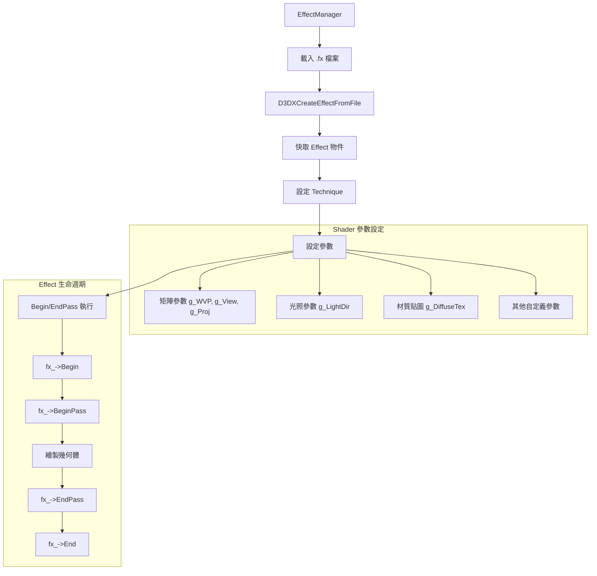
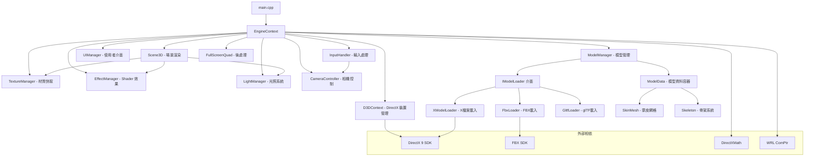

# DirectX 9 引擎架構詳細分析

## 1. 系統初始化流程圖

```mermaid
flowchart TD
    A[WinMain 啟動] --> B[視窗類別註冊 WNDCLASSEX]
    B --> C[建立視窗 CreateWindowEx]
    C --> D[顯示視窗 ShowWindow]
    D --> E[建立 EngineContext]
    E --> F[EngineContext::Initialize]
    
    F --> G[參數驗證]
    G --> H{驗證成功?}
    H -->|否| I[返回 E_INVALIDARG]
    H -->|是| J[建立子系統]
    
    J --> K[建立 TextureManager]
    K --> L[建立 EffectManager]
    L --> M[建立 D3DContext]
    M --> N[建立 ModelManager]
    N --> O[建立 LightManager]
    O --> P[建立 Scene3D]
    P --> Q[建立 UIManager]
    Q --> R[建立 InputHandler]
    R --> S[建立 CameraController]
    S --> T[建立 FullScreenQuad]
    
    T --> U{所有子系統建立成功?}
    U -->|否| V[返回 E_FAIL]
    U -->|是| W[執行主迴圈 Run()]
    
    W --> X[訊息處理迴圈]
    X --> Y[PeekMessage]
    Y --> Z{有訊息?}
    Z -->|是| AA[處理訊息]
    Z -->|否| BB[更新邏輯]
    AA --> BB
    BB --> CC[輸入處理]
    CC --> DD[相機更新]
    DD --> EE[開始渲染]
    EE --> FF[應用效果]
    FF --> GG[應用光照]
    GG --> HH[場景渲染]
    HH --> II[UI渲染]
    II --> JJ[後處理]
    JJ --> KK[Present 到螢幕]
    KK --> LL{程式結束?}
    LL -->|否| Y
    LL -->|是| MM[清理資源]
    MM --> NN[程式結束]
```

## 2. 核心架構組件圖



## 3. 渲染管線流程圖



## 4. 模型載入工作流程



## 5. 資源管理系統圖



## 6. 訊息處理與輸入系統



## 7. 效果系統架構



## 8. 系統依賴關係圖



這個詳細的架構分析展示了整個 DirectX 9 引擎的系統化流程，從初始化到渲染，再到資源管理的完整工作流程。每個組件都有明確的職責分工，並透過介面實現了良好的模組化設計。