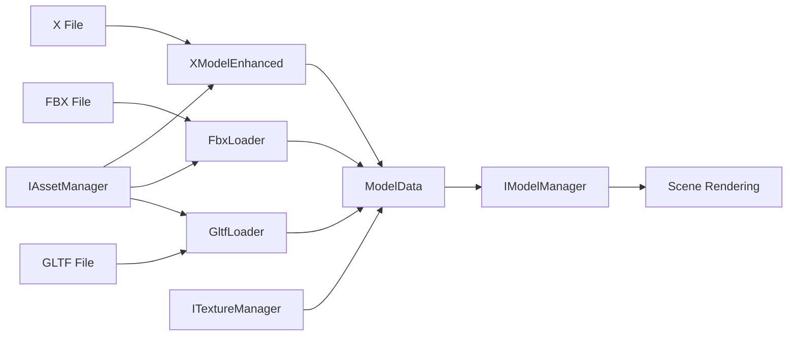

# DX9Sample Architecture Overview

**Date**: 2025-07-23  
**Version**: 1.0

## 1. System Overview and Design Principles

### Core Architecture Pattern
```
EngineContext (orchestrator) → Subsystem Interfaces → Concrete Implementations
```

### Key Design Principles
- **Interface-Driven Design**: All major components defined through pure virtual interfaces (`I*.h` files)
- **Factory Pattern**: Consistent use of factory functions for dependency injection
- **RAII Memory Management**: Smart pointers throughout, no manual memory management
- **Service Locator Pattern**: Centralized access to engine services (modern architecture)
- **Event-Driven Communication**: Decoupled communication via type-safe event system

### Architecture Layers
```
┌─────────────────────────────────────────────────────┐
│                 Application Layer                    │
│              (main.cpp, GameScene)                  │
├─────────────────────────────────────────────────────┤
│                  Engine Layer                        │
│               (EngineContext)                       │
├─────────────────────────────────────────────────────┤
│                Interface Layer                       │
│            (I*.h pure interfaces)                   │
├─────────────────────────────────────────────────────┤
│             Implementation Layer                     │
│        (Concrete classes, *Manager.cpp)             │
├─────────────────────────────────────────────────────┤
│                DirectX 9 Layer                       │
│          (D3D9, D3DX9, Win32 API)                  │
└─────────────────────────────────────────────────────┘
```

## 2. Core Components and Interfaces

### Graphics Systems
| Interface | Implementation | Purpose |
|-----------|----------------|---------|
| `ID3DContext` | `D3DContext` | DirectX device management and initialization |
| `IModelManager` | `ModelManager` | 3D model loading and management |
| `ITextureManager` | `TextureManager` | Thread-safe texture caching with reference counting |
| `IEffectManager` | `EffectManager` | Shader effects (.fx files) management |
| `ILightManager` | `LightManager` | Lighting system with directional/point lights |
| `IScene3D` | `Scene3D` | Scene rendering pipeline |

### Input and Camera
| Interface | Implementation | Purpose |
|-----------|----------------|---------|
| `ICameraController` | `CameraController` | Camera movement, rotation, and zoom controls |
| `IInputHandler` | `InputHandler` | Keyboard and mouse input processing |

### Modern Architecture Systems
| Interface | Implementation | Purpose |
|-----------|----------------|---------|
| `IAssetManager` | `AssetManager` | Unified asset loading with path resolution and caching |
| `IConfigManager` | `JsonConfigManager` | JSON-based configuration system |
| `ISceneManager` | `SceneManager` | Scene stack management with transitions |
| `IUIManager` | `UIManager` | Advanced UI with parent-child hierarchy and drag-drop |
| `IEventManager` | `EventManager` | Type-safe event system with compile-time checking |
| `IServiceLocator` | `ServiceLocator` | Dependency injection container |

## 3. Subsystem Descriptions

### EngineContext (Orchestrator)
**Purpose**: Central hub managing all engine subsystems

**Key Responsibilities**:
- Initialize DirectX 9 device and window
- Create and manage all subsystems
- Execute main render loop
- Coordinate component lifecycle

**Architecture Note**: Currently maintains dual architecture (legacy direct access + modern ServiceLocator) for backward compatibility.

### Model Loading System

#### Supported Format Loaders
- **XFileLoader/XModelLoader**: Basic DirectX .x file support
- **XModelEnhanced**: Enhanced X file loader with multi-object separation
- **FbxLoader**: Autodesk FBX format (texture loading fully implemented 2025-07-23)
- **GltfLoader**: glTF 2.0 format with multi-model support

#### Model Data Flow
```
File → Loader → ModelData → IModelManager → Scene Rendering
                    ↓
              ITextureManager (for texture resolution)
```

#### Animation System
- Skeletal animation with `Skeleton` and `AnimationPlayer` classes
- Vertex skinning via HLSL shaders
- Support for bone hierarchies
- Animation blending capabilities

### Texture Management System

**Architecture**:
```cpp
ITextureManager (Interface)
    └── TextureManager (Thread-safe implementation)
        ├── Shared texture cache (std::unordered_map)
        ├── Reference counting (std::shared_ptr)
        ├── Thread safety (std::shared_mutex)
        └── Path resolution (absolute/relative/test/)
```

**Features**:
- Automatic duplicate prevention
- Thread-safe concurrent access
- Smart path resolution for various asset locations
- Memory-efficient reference counting

### Scene Management

**Dual System Architecture**:
1. **Legacy System**: Direct Scene3D usage with fixed rendering pipeline
2. **Modern System**: SceneManager with stack-based scene handling

**Scene Stack Features**:
- Push/pop operations for scene transitions
- Transparent scenes for overlays (pause menus, inventories)
- Scene lifecycle: Initialize → OnEnter → Update/Render → OnExit → Cleanup
- Service injection for clean dependency management

### UI System Architecture

**Component Hierarchy**:
```
UIManager
├── Legacy System (for compatibility)
│   ├── UITextElement
│   ├── UIImageElement
│   └── UIButton
└── New Component System
    ├── UIComponentNew (base class)
    ├── UIImageNew
    ├── UIButtonNew
    └── UIEditNew
```

**Advanced Features**:
- Parent-child relationships for grouped movement
- Layer-based rendering with priority support
- Pixel-perfect hit testing for transparent images
- Dynamic text update system (ID-based)
- Complete drag-and-drop functionality

### Event System

**Type-Safe Implementation**:
- Compile-time type checking for events
- Immediate and queued event processing
- EventListener base class for automatic subscription management
- Decoupled communication between systems

**Common Event Types**:
- `UIComponentClicked`
- `SceneChanged`
- `AssetLoaded`
- `ConfigurationChanged`
- `GameStateChanged`

## 4. Dependency Relationships

### System Dependency Graph
```
┌──────────────┐     ┌──────────────┐     ┌──────────────┐
│     Main     │────▶│EngineContext│◀────│ServiceLocator│
└──────────────┘     └──────┬───────┘     └──────────────┘
                            │
        ┌───────────────────┼───────────────────┐
        │                   │                   │
   ┌────▼─────┐      ┌─────▼──────┐     ┌─────▼──────┐
   │D3DContext│      │SceneManager│     │AssetManager│
   └──────────┘      └────────────┘     └────────────┘
        │                   │                   │
   ┌────▼─────┐      ┌─────▼──────┐     ┌─────▼──────┐
   │  Device  │      │   Scenes   │     │  Loaders   │
   └──────────┘      └────────────┘     └────────────┘
```

### Model Loading Dependencies


## 5. Current Implementation Status

### ✅ Fully Implemented and Working
- X file loading with multi-object support
- FBX loading with texture support (completed 2025-07-23)
- Basic glTF 2.0 loading
- Thread-safe texture management
- UI system with drag-and-drop
- Scene management with stack operations
- Camera controls (mouse rotation, zoom)
- Simple texture shader rendering

### ⚠️ Partially Implemented
- ServiceLocator pattern (coexists with legacy)
- Event system (not all components integrated)
- Asset streaming capabilities
- Skeletal animation shaders

### ❌ Known Issues
- Dual architecture creates confusion
- Skeletal animation shader renders black
- Some unused/redundant components remain
- Model data structure fragmentation (ModelData vs ModelDataV2)

### 📊 Recent Improvements (2025-07-23)
- Phase 1 cleanup completed (~3,000 lines removed)
- FBX texture loading fully implemented
- Comprehensive documentation created
- Multi-object X file support enhanced

## 6. Architecture Patterns Used

### Design Patterns
1. **Factory Pattern**: All interfaces provide `Create*()` factory functions
2. **Service Locator**: Modern dependency injection (ServiceLocator class)
3. **Observer Pattern**: Event system for decoupled communication
4. **Composite Pattern**: UI hierarchy with parent-child relationships
5. **Strategy Pattern**: Multiple model loaders for different formats
6. **RAII Pattern**: Automatic resource management via smart pointers

### Memory Management Strategy
- `std::unique_ptr`: For interface implementations and exclusive ownership
- `std::shared_ptr`: For shared resources (textures, models)
- `Microsoft::WRL::ComPtr`: For COM objects (DirectX interfaces)
- `UniqueWithWeak`: Custom wrapper for objects needing weak references
- No manual `new`/`delete` - all allocation through smart pointers

### Threading Model
- Main thread: Rendering and game logic
- Texture manager: Thread-safe with `std::shared_mutex`
- Asset loading: Currently single-threaded (future: async loading)
- Event system: Thread-safe publishing and processing

## Build Configuration and Dependencies

### External Dependencies
- DirectX SDK (June 2010)
- FBX SDK 2020.3.7
- Windows 10 SDK
- Visual Studio 2022 (v143 toolset)
- C++20 standard

### Project Structure
```
DX9Sample/
├── Src/              # Source files
│   ├── I*.h         # Interface definitions
│   ├── *Manager.*   # Manager implementations
│   ├── *Loader.*    # Model format loaders
│   └── *Scene.*     # Scene implementations
├── test/            # Runtime directory with assets
├── doc/             # Comprehensive documentation
├── shaders/         # HLSL shader files
└── DX9Sample.sln    # Visual Studio solution
```

### Build Command
```bash
"C:\Program Files\Microsoft Visual Studio\2022\Community\MSBuild\Current\Bin\MSBuild.exe" DX9Sample.sln -p:Configuration=Debug -p:Platform=x64
```

## Future Architecture Direction

### Short-term Goals
1. Complete ServiceLocator migration
2. Remove legacy initialization paths
3. Consolidate model data structures
4. Implement comprehensive error handling

### Long-term Vision
1. Full event-driven architecture
2. Multi-threaded asset loading
3. Modern rendering techniques (shadows, post-processing)
4. Plugin system for extensibility
5. Potential DirectX 11/12 upgrade path

## Summary

The DX9Sample engine demonstrates solid engineering principles with its interface-based architecture and consistent use of modern C++ patterns. While currently maintaining dual architectures for compatibility, the system is well-positioned for consolidation. The modular design, comprehensive factory pattern usage, and thread-safe implementations provide a strong foundation for future enhancements.

Key strengths include the flexible model loading system supporting multiple formats, the advanced UI system with modern features, and the type-safe event system enabling decoupled communication. With focused refactoring to eliminate the architectural duality and complete the modern system integration, this engine can serve as an excellent platform for advanced 3D graphics applications.