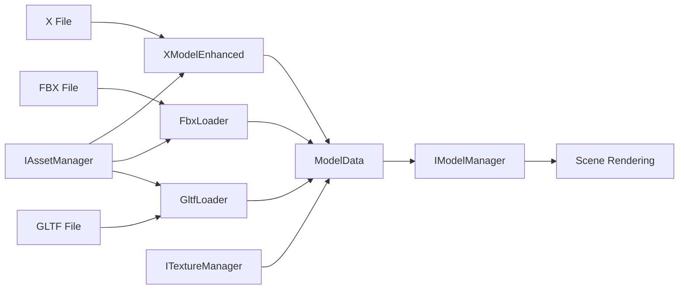

# DX9Sample System Architecture Analysis

**Date**: 2025-07-23  
**Version**: 1.0

## Executive Summary

DX9Sample is a modular DirectX 9 3D graphics engine with a dual architecture (legacy and modern). The system uses interface-based design with factory patterns throughout, providing excellent extensibility but suffering from architectural fragmentation.

## Table of Contents

1. [System Architecture Overview](#system-architecture-overview)
2. [Core Components](#core-components)
3. [Data Flow Analysis](#data-flow-analysis)
4. [Architecture Diagrams](#architecture-diagrams)
5. [Code Quality Assessment](#code-quality-assessment)
6. [Technical Debt](#technical-debt)
7. [Future Roadmap](#future-roadmap)
8. [Recommendations](#recommendations)

## System Architecture Overview

### Architecture Principles

1. **Interface-Based Design**: All major components are defined through pure virtual interfaces
2. **Factory Pattern**: Consistent use of factory functions for object creation
3. **Dependency Injection**: ServiceLocator pattern for modern components
4. **RAII**: Resource management through smart pointers
5. **Event-Driven**: Decoupled communication via event system

### Architecture Layers

```
┌─────────────────────────────────────────────────────┐
│                 Application Layer                    │
│              (main.cpp, GameScene)                  │
├─────────────────────────────────────────────────────┤
│                  Engine Layer                        │
│               (EngineContext)                       │
├─────────────────────────────────────────────────────┤
│                Interface Layer                       │
│            (I*.h pure interfaces)                   │
├─────────────────────────────────────────────────────┤
│             Implementation Layer                     │
│        (Concrete classes, *Manager.cpp)             │
├─────────────────────────────────────────────────────┤
│                DirectX 9 Layer                       │
│          (D3D9, D3DX9, Win32 API)                  │
└─────────────────────────────────────────────────────┘
```

## Core Components

### 1. EngineContext (Orchestrator)

**Purpose**: Central hub managing all engine subsystems

**Key Responsibilities**:
- Initialize DirectX 9 device
- Create and manage subsystems
- Handle main render loop
- Coordinate component lifecycle

**Design Issues**:
- Mixes legacy direct access with modern ServiceLocator
- Contains both old and new initialization paths
- Tight coupling with some components

### 2. Model Loading System



**Components**:
- **XModelEnhanced**: Handles DirectX .x files with multi-object support
- **FbxLoader**: Autodesk FBX format (texture loading recently fixed)
- **GltfLoader**: glTF 2.0 support (basic implementation)
- **ModelManager**: Legacy model management
- **AssetManager**: Modern unified asset loading

### 3. Texture Management

**Current Implementation**:
```cpp
ITextureManager (Interface)
    ├── TextureManager (Thread-safe implementation)
    │   ├── Shared texture cache
    │   ├── Reference counting
    │   └── Path resolution
    └── ImprovedTextureManager (Unused alternative)
```

**Features**:
- Thread-safe access with shared_mutex
- Automatic duplicate prevention
- Reference counting for memory management
- Path resolution for relative/absolute paths

### 4. Scene Management

**Dual System**:
1. **Legacy**: Direct Scene3D usage
2. **Modern**: SceneManager with stack-based scene handling

```
SceneManager (Modern)
    ├── Scene stack (push/pop)
    ├── Transparent overlay support
    ├── Lifecycle management
    └── Service injection
    
Scene3D (Legacy)
    ├── Direct rendering
    ├── Fixed pipeline
    └── Basic camera control
```

### 5. UI System

**Current State**:
- **UIManager**: Fully implemented with parent-child hierarchy
- **UISystem**: Attempted but incomplete (commented out)
- Features: Dynamic text, drag support, layer-based rendering

### 6. Event System

```cpp
IEventManager
    ├── Type-safe event publishing
    ├── Immediate and queued processing
    ├── EventListener base class
    └── Compile-time type checking
```

## Data Flow Analysis

### Model Loading Pipeline

```
1. File Selection
   └── User requests model load (e.g., "horse.fbx")

2. Asset Manager Route
   ├── IAssetManager::LoadModel()
   ├── Determines appropriate loader
   └── Returns shared_ptr<ModelData>

3. Loader Processing
   ├── Parse file format
   ├── Extract geometry, materials, textures
   ├── Convert to internal format
   └── Create ModelData structure

4. Texture Resolution
   ├── Extract texture references
   ├── ITextureManager::LoadTexture()
   ├── Check cache for existing
   └── Load from disk if needed

5. Model Registration
   ├── Add to scene graph
   ├── Setup rendering data
   └── Initialize animations

6. Rendering
   ├── Scene traversal
   ├── Frustum culling
   ├── State sorting
   └── Draw calls
```

### Texture Loading Detail (FBX Example)

```
FBX File
    ├── Material with DiffuseColor property
    ├── FbxFileTexture object attached
    └── Filename property: "horse3.bmp"
    
FbxLoader::ExtractMaterials()
    ├── Find texture property
    ├── Extract filename
    └── LoadTextureFromFile()
        ├── Try absolute path
        ├── Try relative to FBX
        ├── Try test/ directory
        └── Try current directory
        
ITextureManager::LoadTexture()
    ├── Check cache
    ├── D3DXCreateTextureFromFile()
    └── Store with reference count
```

## Architecture Diagrams

### Component Dependency Graph

```
┌──────────────┐     ┌──────────────┐     ┌──────────────┐
│     Main     │────▶│EngineContext│◀────│ServiceLocator│
└──────────────┘     └──────┬───────┘     └──────────────┘
                            │
        ┌───────────────────┼───────────────────┐
        │                   │                   │
   ┌────▼─────┐      ┌─────▼──────┐     ┌─────▼──────┐
   │D3DContext│      │SceneManager│     │AssetManager│
   └──────────┘      └────────────┘     └────────────┘
        │                   │                   │
   ┌────▼─────┐      ┌─────▼──────┐     ┌─────▼──────┐
   │  Device  │      │   Scenes   │     │  Loaders   │
   └──────────┘      └────────────┘     └────────────┘
```

### Class Hierarchy (Simplified)

```
IEngineContext
├── ID3DContext ──────────── D3DContext
├── IModelManager ────────── ModelManager
├── ITextureManager ──────── TextureManager
├── IEffectManager ───────── EffectManager
├── ISceneManager ────────── SceneManager
├── IAssetManager ────────── AssetManager
├── IUIManager ───────────── UIManager
└── IEventManager ────────── EventManager

IModelLoader
├── XModelLoader (basic)
├── XModelEnhanced (multi-object)
├── FbxLoader (with textures)
└── GltfLoader (basic)

IScene
├── Scene (base)
├── GameScene
├── PauseScene
└── SettingsScene
```

## Code Quality Assessment

### Strengths

1. **Interface Design**: Clean separation of interface and implementation
2. **Memory Management**: Consistent use of smart pointers
3. **Factory Pattern**: Well-implemented throughout
4. **Thread Safety**: Properly implemented in critical areas
5. **Error Handling**: Consistent HRESULT usage in DirectX code

### Weaknesses

1. **Architectural Fragmentation**: Dual architecture creates confusion
2. **Code Duplication**: Similar functionality in multiple places
3. **Incomplete Transitions**: Modern systems partially implemented
4. **Documentation**: Sparse inline documentation
5. **Testing**: No unit tests present

### Code Metrics (Estimated)

- **Total Lines**: ~15,000
- **Files**: ~100
- **Classes**: ~60
- **Interfaces**: ~25
- **Cyclomatic Complexity**: Medium-High in some areas

## Technical Debt

### High Priority Issues

1. **Dual Architecture**
   - Legacy and modern systems coexist
   - Increases maintenance burden
   - Confuses new developers

2. **Unused Code**
   - ImprovedTextureManager
   - RenderTargetManager (implemented but not integrated)
   - Multiple UI system attempts

3. **Model Data Fragmentation**
   - ModelData vs ModelDataV2
   - Different structures for different loaders
   - Inconsistent material handling

### Medium Priority Issues

1. **Incomplete Event System Usage**
   - Some components still use direct coupling
   - Event types not fully defined
   - Missing error event handling

2. **Resource Management**
   - No unified resource budget
   - Missing asset streaming
   - No level-of-detail system

3. **Error Handling Inconsistency**
   - Mix of HRESULT and exceptions
   - Silent failures in some areas
   - Incomplete error propagation

### Low Priority Issues

1. **Performance Optimizations**
   - Single-threaded asset loading
   - No draw call batching
   - Inefficient state changes

2. **Modern C++ Usage**
   - Could use more C++20 features
   - Some raw pointers remain
   - Older coding patterns in places

## Future Roadmap

### Phase 1: Consolidation (1-2 months)

1. **Remove Unused Components**
   - Delete ImprovedTextureManager
   - Remove incomplete UI system attempts
   - Clean up unused loader variants

2. **Unify Architecture**
   - Complete ServiceLocator integration
   - Remove legacy initialization paths
   - Standardize on modern patterns

3. **Consolidate Model System**
   - Merge ModelData structures
   - Create unified loader interface
   - Implement format converter

### Phase 2: Enhancement (2-3 months)

1. **Complete Modern Systems**
   - Full event system integration
   - Asset streaming implementation
   - Hot-reload capability

2. **Performance Improvements**
   - Multi-threaded loading
   - GPU resource pooling
   - Draw call batching

3. **Developer Experience**
   - Add comprehensive logging
   - Implement debug overlays
   - Create performance profiler

### Phase 3: Advanced Features (3-6 months)

1. **Rendering Enhancements**
   - Add shadow mapping
   - Implement post-processing
   - Add particle system

2. **Asset Pipeline**
   - Implement asset baking
   - Add compression support
   - Create asset dependency graph

3. **Tools Development**
   - Scene editor
   - Material editor
   - Performance analyzer

## Recommendations

### Immediate Actions

1. **Document Existing Code**
   - Add inline documentation
   - Create usage examples
   - Document architectural decisions

2. **Setup Testing Framework**
   - Add unit tests for core components
   - Create integration tests
   - Implement continuous integration

3. **Code Cleanup Sprint**
   - Remove dead code
   - Fix compiler warnings
   - Standardize naming conventions

### Short-term Goals

1. **Complete Architecture Migration**
   - Finish ServiceLocator integration
   - Remove all legacy paths
   - Update all components to modern patterns

2. **Improve Build System**
   - Add CMake support
   - Implement dependency management
   - Create debug/release configurations

3. **Enhance Developer Documentation**
   - Create getting started guide
   - Document common workflows
   - Add troubleshooting section

### Long-term Vision

1. **Modernize Rendering**
   - Consider DirectX 11/12 upgrade path
   - Add Vulkan support option
   - Implement modern rendering techniques

2. **Create Ecosystem**
   - Develop content creation tools
   - Build asset marketplace
   - Create plugin system

3. **Community Building**
   - Open source appropriate components
   - Create tutorial series
   - Build contributor guidelines

## Conclusion

DX9Sample demonstrates solid engineering principles with its interface-based architecture and consistent use of design patterns. However, the dual architecture and accumulated technical debt require attention. The recommended consolidation phase would significantly improve maintainability while preserving the system's extensibility strengths.

The recent successful implementation of FBX texture loading shows the codebase's flexibility and the team's capability to extend functionality. With focused refactoring and the removal of redundant components, this engine could serve as an excellent foundation for more advanced features.

## Appendices

### A. File Organization

```
DX9Sample/
├── Src/
│   ├── I*.h              (Interfaces)
│   ├── *Manager.cpp      (Managers)
│   ├── *Loader.cpp       (Loaders)
│   └── *Scene.cpp        (Scenes)
├── test/                 (Assets & output)
├── doc/                  (Documentation)
└── Effects/             (Shader files)
```

### B. Key Design Patterns Used

1. **Factory Pattern**: Object creation
2. **Service Locator**: Dependency injection
3. **Observer Pattern**: Event system
4. **Composite Pattern**: UI hierarchy
5. **Strategy Pattern**: Model loaders
6. **Singleton Pattern**: Some managers (avoid in future)

### C. External Dependencies

- DirectX 9 SDK (June 2010)
- FBX SDK 2020.3.7
- Windows 10 SDK
- Visual Studio 2022
- C++20 Standard Library