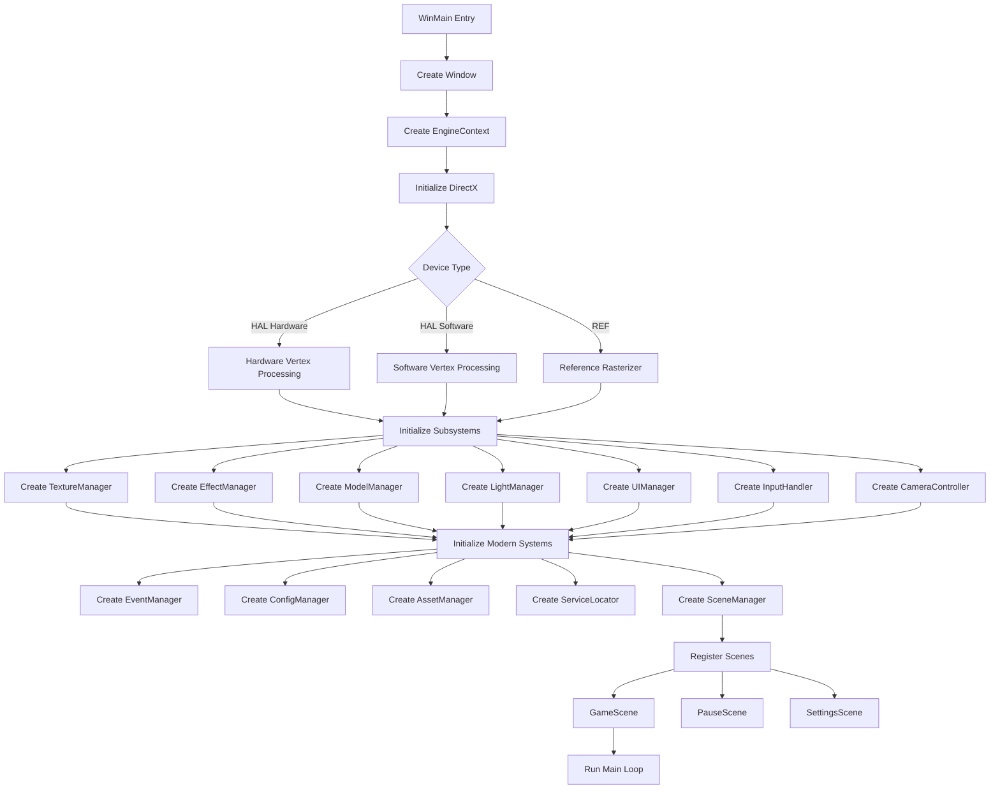
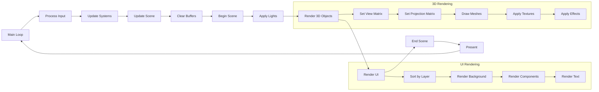
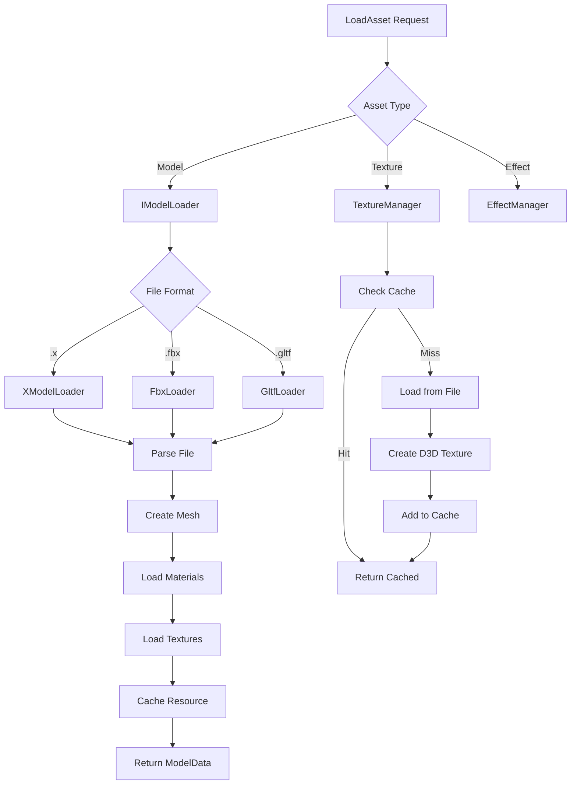
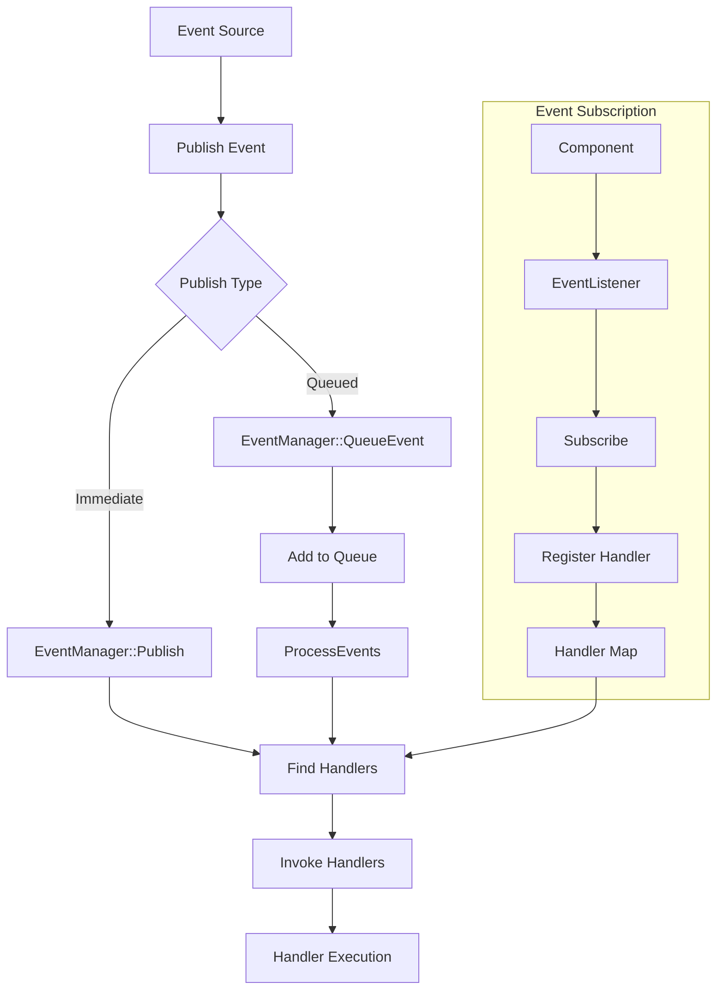
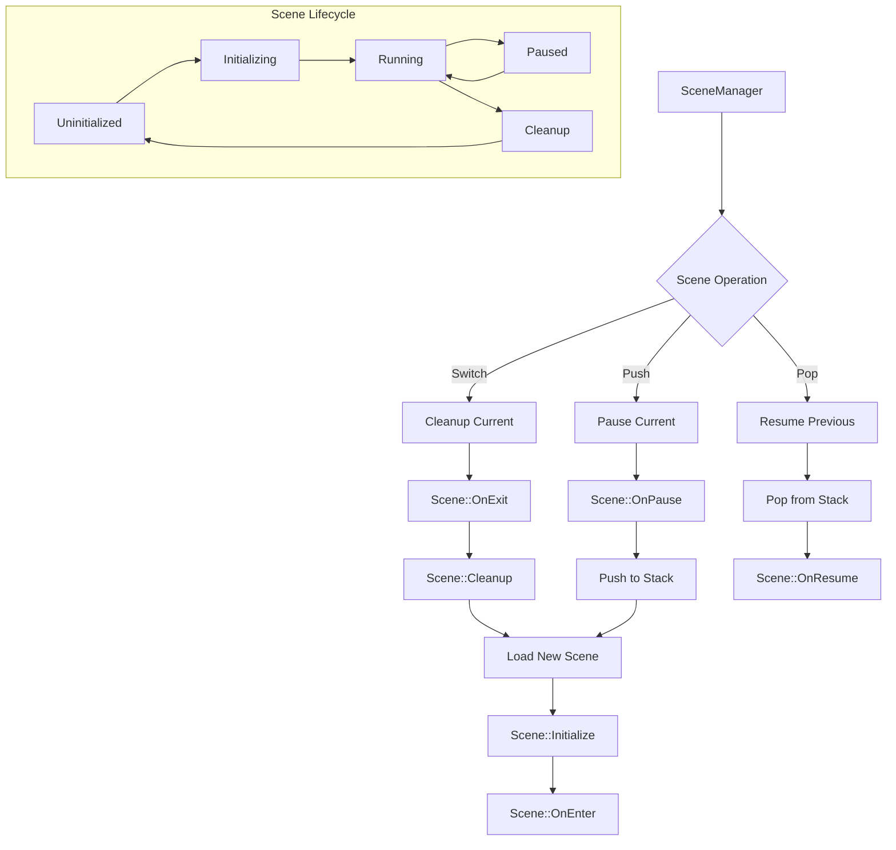
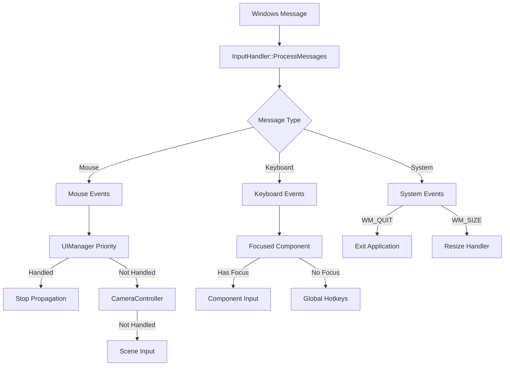
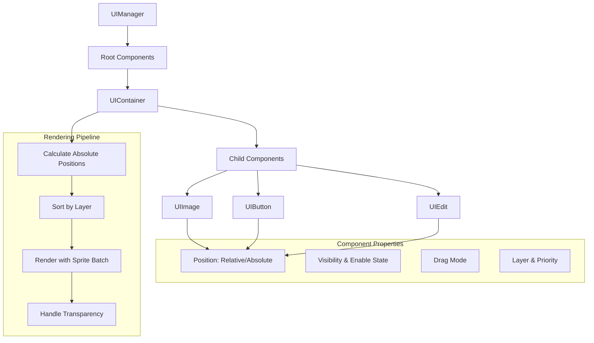
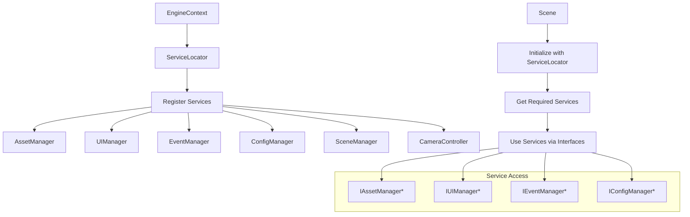

# 系統架構流程圖

**最後更新**: 2025-07-23  
**版本**: 2.0

## 1. 系統初始化流程

## 2. 渲染管線流程

## 3. 資源載入流程

## 4. 事件系統流程

## 5. 場景管理流程

## 6. 輸入處理流程

## 7. UI 系統架構

## 8. 依賴注入架構

## 關鍵架構特點

1. **模組化設計**: 每個子系統都透過介面定義，實現解耦
2. **Factory Pattern**: 所有主要元件都使用工廠函式創建
3. **事件驅動**: 使用類型安全的事件系統進行元件通訊
4. **資源管理**: 智慧指標確保記憶體安全
5. **場景堆疊**: 支援場景覆蓋（如暫停選單）
6. **優先級輸入**: UI 優先處理輸入，然後傳遞給其他系統

## 效能考量

- **紋理快取**: 避免重複載入
- **批次渲染**: UI 使用 sprite batch
- **延遲載入**: 資源按需載入
- **事件佇列**: 避免即時處理阻塞

## 錯誤處理策略

- **HRESULT**: DirectX API 錯誤碼
- **例外處理**: 現代 C++ 例外
- **日誌系統**: OutputDebugString 除錯輸出
- **優雅降級**: 硬體不支援時降級到軟體模式