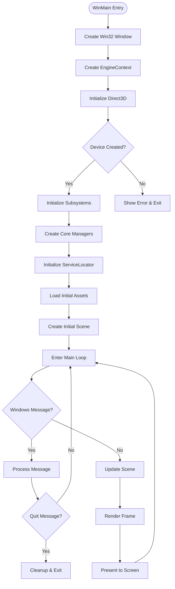
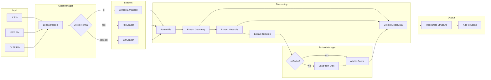
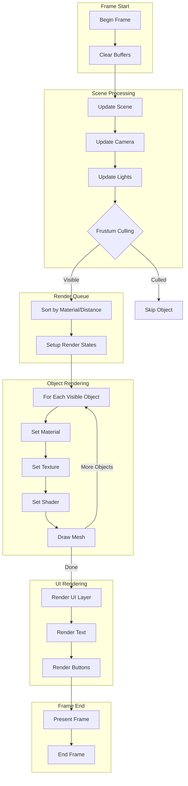
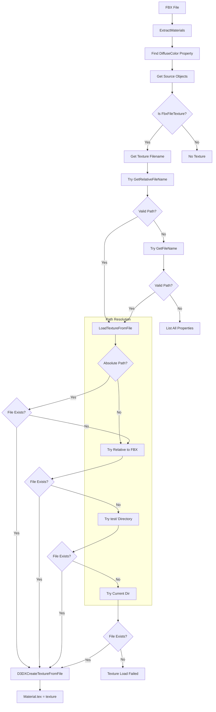
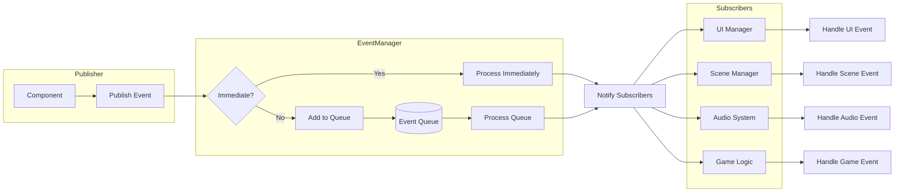
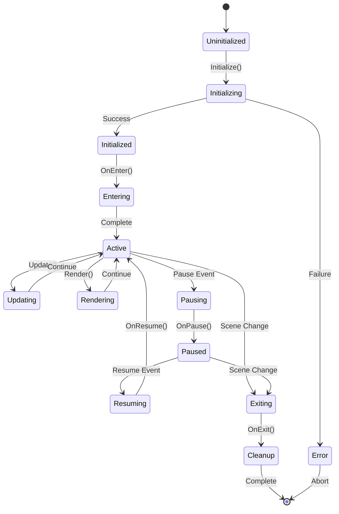
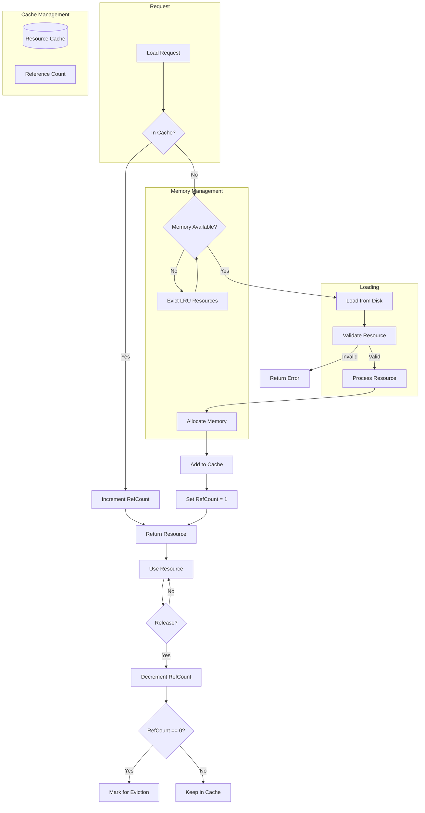
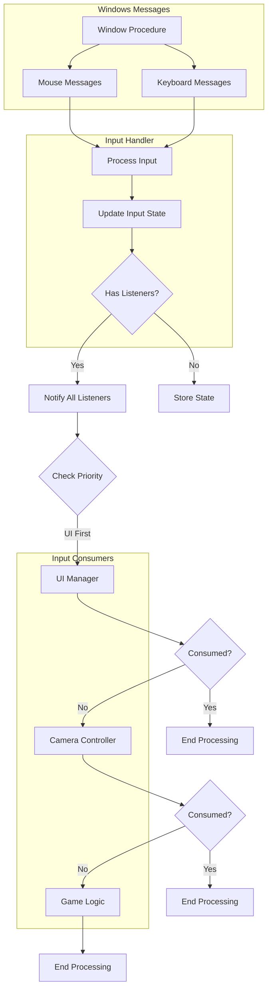

# System Flow Diagrams

## 1. Application Startup Flow

## 2. Model Loading Pipeline

## 3. Rendering Pipeline

## 4. Texture Loading Flow (FBX Specific)

## 5. Event System Flow

## 6. Scene Management Flow

## 7. Resource Management Flow

## 8. Input Processing Flow

## Usage Notes

These diagrams illustrate the key flows within the DX9Sample engine:

1. **Startup Flow**: Shows initialization sequence and main loop
2. **Model Loading**: Details the asset loading pipeline
3. **Rendering**: Describes frame rendering process
4. **Texture Loading**: FBX-specific texture resolution
5. **Event System**: Event publishing and handling
6. **Scene Management**: Scene lifecycle states
7. **Resource Management**: Cache and memory handling
8. **Input Processing**: Input event routing

Each diagram can be rendered using Mermaid-compatible tools or documentation systems that support Mermaid syntax.