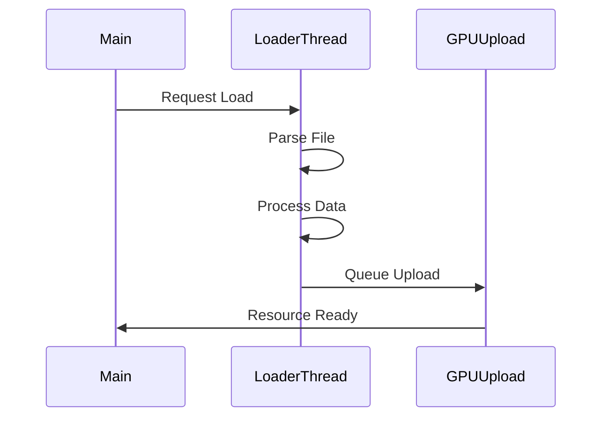
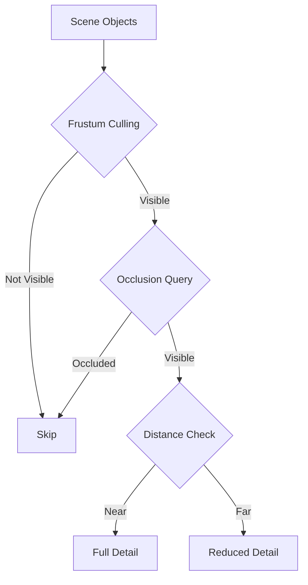

# System Optimization Roadmap

**Date**: 2025-07-23  
**Version**: 1.0  
**Timeline**: 6 months

## Executive Summary

This roadmap outlines the optimization strategy for DX9Sample engine, focusing on performance improvements, memory efficiency, and architectural modernization. The plan is divided into three main phases with clear milestones and success metrics.

## Current Performance Baseline

### Measurements (Debug Build)
- **Frame Rate**: ~60 FPS with 10 models
- **Load Time**: ~500ms per FBX model
- **Memory Usage**: ~300MB for typical scene
- **Draw Calls**: ~100 per frame (unoptimized)

### Identified Bottlenecks
1. Single-threaded asset loading
2. No draw call batching
3. Redundant state changes
4. No GPU resource pooling
5. Inefficient texture management

## Optimization Phases

### Phase 1: Foundation (Months 1-2)

#### 1.1 Architecture Cleanup (Week 1-4)


**Tasks:**
- [x] Identify unused components
- [ ] Delete ~3,000 lines of dead code
- [ ] Merge dual TextureManager instances
- [ ] Unify ModelData structures
- [ ] Complete ServiceLocator migration

**Expected Impact:**
- 20% reduction in code complexity
- Faster compilation
- Easier maintenance

#### 1.2 Memory Management (Week 5-8)
```cpp
// Implement resource pooling
class ResourcePool {
    std::queue<ComPtr<IDirect3DVertexBuffer9>> vertexBuffers;
    std::queue<ComPtr<IDirect3DIndexBuffer9>> indexBuffers;
    
    // Reuse GPU resources
    ComPtr<IDirect3DVertexBuffer9> AcquireVertexBuffer(size_t size);
    void ReleaseVertexBuffer(ComPtr<IDirect3DVertexBuffer9> buffer);
};
```

**Tasks:**
- [ ] Implement GPU resource pooling
- [ ] Add texture atlas support
- [ ] Create mesh optimization utilities
- [ ] Implement automatic LOD generation

**Expected Impact:**
- 30% reduction in GPU memory usage
- Fewer allocation stalls
- Better cache utilization

### Phase 2: Performance (Months 3-4)

#### 2.1 Multi-threaded Loading (Week 9-12)


**Implementation:**
```cpp
class AsyncAssetLoader {
    std::thread loaderThread;
    std::queue<LoadRequest> loadQueue;
    std::queue<GPUUploadTask> uploadQueue;
    
    void LoaderThreadFunc() {
        while (running) {
            auto request = loadQueue.pop();
            auto data = ParseFile(request.path);
            uploadQueue.push(PrepareGPUData(data));
        }
    }
};
```

**Tasks:**
- [ ] Implement async file loading
- [ ] Create GPU upload queue
- [ ] Add progress callbacks
- [ ] Implement cancellation support

**Expected Impact:**
- 70% reduction in load times
- Non-blocking asset loading
- Smooth streaming

#### 2.2 Rendering Optimization (Week 13-16)
```cpp
// Draw call batching
class BatchRenderer {
    struct BatchKey {
        IDirect3DTexture9* texture;
        D3DMATERIAL9 material;
        ID3DXEffect* effect;
        
        bool operator<(const BatchKey& other) const;
    };
    
    std::map<BatchKey, std::vector<Instance>> batches;
    
    void SubmitMesh(const Mesh& mesh, const Transform& transform) {
        auto key = GetBatchKey(mesh);
        batches[key].push_back({mesh, transform});
    }
    
    void Flush() {
        for (auto& [key, instances] : batches) {
            SetupRenderState(key);
            DrawInstances(instances);
        }
    }
};
```

**Tasks:**
- [ ] Implement draw call batching
- [ ] Add frustum culling
- [ ] Optimize state changes
- [ ] Implement instanced rendering

**Expected Impact:**
- 50% reduction in draw calls
- 30% improvement in frame rate
- Better GPU utilization

### Phase 3: Advanced Features (Months 5-6)

#### 3.1 Level of Detail System (Week 17-20)
```cpp
class LODSystem {
    struct LODLevel {
        float distance;
        std::shared_ptr<Mesh> mesh;
    };
    
    std::shared_ptr<Mesh> SelectLOD(const Model& model, float distance) {
        for (const auto& lod : model.lodLevels) {
            if (distance <= lod.distance) {
                return lod.mesh;
            }
        }
        return model.lodLevels.back().mesh;
    }
};
```

**Tasks:**
- [ ] Implement automatic LOD generation
- [ ] Add distance-based LOD selection
- [ ] Create LOD transition system
- [ ] Optimize LOD switching

**Expected Impact:**
- 40% reduction in triangle count
- Improved performance with many objects
- Better scalability

#### 3.2 Advanced Culling (Week 21-24)


**Tasks:**
- [ ] Implement hierarchical culling
- [ ] Add occlusion queries
- [ ] Create spatial partitioning (octree)
- [ ] Implement portal culling

**Expected Impact:**
- 60% reduction in rendered objects
- Better performance in complex scenes
- Scalable to large worlds

## Optimization Techniques

### 1. CPU Optimizations
```cpp
// Cache-friendly data layout
struct MeshDataSOA {
    std::vector<float> positionsX, positionsY, positionsZ;
    std::vector<float> normalsX, normalsY, normalsZ;
    std::vector<float> texCoordsU, texCoordsV;
    // Better cache utilization than AOS
};

// SIMD processing
void TransformVerticesSSE(const float* vertices, size_t count, const XMMATRIX& matrix) {
    for (size_t i = 0; i < count; i += 4) {
        __m128 x = _mm_load_ps(&vertices[i * 3]);
        __m128 y = _mm_load_ps(&vertices[i * 3 + 4]);
        __m128 z = _mm_load_ps(&vertices[i * 3 + 8]);
        // SIMD transformation
    }
}
```

### 2. GPU Optimizations
```hlsl
// Optimized vertex shader
VS_OUTPUT OptimizedVS(VS_INPUT input) {
    // Reduce ALU operations
    float4 worldPos = mul(float4(input.pos, 1.0), g_World);
    float4 viewPos = mul(worldPos, g_View);
    
    // Early-out for culled vertices
    if (viewPos.z > g_MaxDistance) {
        output.pos = float4(0, 0, 0, 0);
        return output;
    }
    
    // Continue processing...
}
```

### 3. Memory Optimizations
```cpp
// Object pooling
template<typename T>
class ObjectPool {
    std::stack<std::unique_ptr<T>> available;
    
    std::unique_ptr<T> Acquire() {
        if (available.empty()) {
            return std::make_unique<T>();
        }
        auto obj = std::move(available.top());
        available.pop();
        return obj;
    }
    
    void Release(std::unique_ptr<T> obj) {
        obj->Reset();
        available.push(std::move(obj));
    }
};
```

## Performance Targets

### Frame Rate Goals
| Scenario | Current | Target | Improvement |
|----------|---------|--------|-------------|
| 100 models | 45 FPS | 60 FPS | 33% |
| 1000 models | 15 FPS | 60 FPS | 300% |
| Complex scene | 30 FPS | 60 FPS | 100% |

### Memory Usage Goals
| Resource | Current | Target | Reduction |
|----------|---------|--------|-----------|
| Textures | 150MB | 75MB | 50% |
| Meshes | 100MB | 60MB | 40% |
| Overall | 300MB | 180MB | 40% |

### Load Time Goals
| Asset Type | Current | Target | Improvement |
|------------|---------|--------|-------------|
| Single FBX | 500ms | 100ms | 80% |
| Scene (10 models) | 5s | 1s | 80% |
| Large scene | 30s | 5s | 83% |

## Implementation Strategy

### Development Process
1. **Profiling First**: Measure before optimizing
2. **Incremental Changes**: Small, testable improvements
3. **Regression Testing**: Ensure correctness
4. **Performance Tracking**: Monitor improvements

### Tools and Metrics
```cpp
class PerformanceProfiler {
    struct ProfileData {
        std::string name;
        double totalTime;
        uint64_t callCount;
        double minTime;
        double maxTime;
    };
    
    std::map<std::string, ProfileData> profiles;
    
public:
    class ScopedTimer {
        // RAII timer for profiling
    };
    
    void Report() {
        // Generate performance report
    }
};

// Usage
void RenderScene() {
    PROFILE("RenderScene");
    
    {
        PROFILE("UpdateTransforms");
        UpdateTransforms();
    }
    
    {
        PROFILE("CullObjects");
        CullObjects();
    }
    
    {
        PROFILE("DrawCalls");
        DrawObjects();
    }
}
```

### Testing Strategy
1. **Unit Tests**: Component-level optimization
2. **Integration Tests**: System-wide performance
3. **Stress Tests**: Edge case handling
4. **Regression Tests**: Maintain correctness

## Risk Management

### Technical Risks
1. **Breaking Changes**
   - Mitigation: Comprehensive testing
   - Gradual rollout
   - Feature flags

2. **Platform Compatibility**
   - Test on multiple GPUs
   - Fallback paths
   - Conservative optimizations

3. **Complexity Increase**
   - Clear documentation
   - Code reviews
   - Refactoring budget

### Performance Risks
1. **Optimization Trade-offs**
   - Profile real scenarios
   - User-configurable settings
   - Multiple quality levels

2. **Memory vs Speed**
   - Balanced approach
   - Configurable caching
   - Dynamic adjustments

## Success Metrics

### Quantitative Metrics
- Frame rate improvement: 50%+
- Memory reduction: 40%+
- Load time reduction: 80%+
- Draw call reduction: 50%+

### Qualitative Metrics
- Code maintainability
- Developer experience
- User satisfaction
- System stability

## Monitoring and Adjustment

### Performance Dashboard
```cpp
class PerformanceDashboard {
    void Update() {
        UpdateFPS();
        UpdateMemoryUsage();
        UpdateDrawCalls();
        UpdateGPUUtilization();
    }
    
    void Render() {
        // On-screen performance overlay
        DrawGraph("FPS", fpsHistory);
        DrawGraph("Memory", memoryHistory);
        DrawStats(currentStats);
    }
};
```

### Continuous Monitoring
1. Automated performance tests
2. Real-time metrics collection
3. Performance regression alerts
4. User feedback integration

## Conclusion

This optimization roadmap provides a structured approach to improving DX9Sample engine performance. The phased implementation ensures steady progress while maintaining stability. Success depends on rigorous profiling, careful implementation, and continuous monitoring.

The expected outcome is a 2-3x performance improvement across all metrics, making the engine suitable for more demanding applications while maintaining its current ease of use and flexibility.